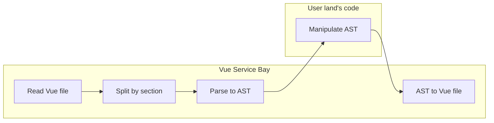

# Vue Service Bay

## Overview

Meet Vue Service Bay—your go-to micro-utility for effortless, bulk modifications in Vue.js components. Say goodbye to tedious, manual refactoring and accelerate your development pipeline with this lightweight yet powerful tool.

## Motivation

Refactoring generally follows one of two approaches: incremental or wholesale. The approach you choose depends on your project. For instance, if you need to apply a new design system across your entire codebase all at once, this tool is invaluable. Machines can execute simple tasks far faster and more accurately than humans. Automating your refactoring tasks with this library will significantly improve efficiency and accuracy. This repository provides a tool for applying such refactoring to Vue.js components.

## How the Migration Works

The following flowchart simplifies the interaction between this repository and your workflow:



Even if you're new to manipulating AST (Abstract Syntax Trees), this repository provides plenty of examples to get you started.

## Playground

To try out this tool, clone the repository:

```shell
git clone git@github.com:flyle-io/vue-service-bay.git
cd vue-service-bay
npm install
cd packages/examples
node migration/index.js
# Check the migration results however you like!
git difftool
```

## How to Use

### Installation

Install Vue Service Bay as a dev dependency:

```sh
npm i -D vue-service-bay
```

The `-D` flag installs the package as a development dependency.

### Create a Migration Runner File

First, you'll need to create a migration runner script. For more details, please refer to the [index.js](https://github.com/flyle-io/vue-service-bay/tree/main/packages/examples/migration/index.js) in our examples.

### Implement the Runner Script

Next, you'll need to implement specific migration logic. See our examples for more details:

- [Regexp example](https://github.com/flyle-io/vue-service-bay/tree/main/packages/examples/migration/001_RegexpExamples.js)
- [Ast example](https://github.com/flyle-io/vue-service-bay/tree/main/packages/examples/migration/002_AstManipulateExamples.js)
- [MagicString example](https://github.com/flyle-io/vue-service-bay/tree/main/packages/examples/migration/003_MagicStringExamples.js)

### Run the Migration Runner

Execute your migration runner script:

```sh
node index.js
```

## COLUMN: How to read AST effectively

ASTs are complicated and bizarre for the first-time viewer. On the other hand, if you can master ASTs, they can be a great weapon for refactoring and other language processing programming. Here, we will explain how to understand AST in a simple way.

First, programming languages are often treated as an Abstract Syntax Tree (AST) for ease of understanding; an AST is a data structure widely used by compilers to represent the structure of program code.

This library also uses ASTs for refactoring. Simply put, a program is turned into an AST, and then the AST is manipulated and written back into the program again.

Fortunately, there are tools out there to easily understand AST.
That is [AST Explorer](https://astexplorer.net/).

Using AST Explorer, we can automatically jump to the corresponding AST by clicking anywhere. This makes it easy to find out information about the Node we want to process and its surrounding Nodes, including its parent.

Lastly, we will explain how to view ASTs for each language.

### HTML

We use `htmlparser2` for our HTML parser. At the time of the original implementation of this library, `htmlparser2` was the only major parser that could correctly write ASTs back to HTML.

To view ASTs parsed by `htmlparser2`, select the HTML language and `htmlparser2` in the AST Explorer.

### JavaScript / TypeScript

We use `recast` for our JavaScript / TypeScript parser. At the time of the original implementation of this library, `acorn` was the only major parser that could correctly write ASTs back to HTML.
We first tried acorn but could not adopt it because acorn ignores comments. We also wanted to support TypeScript, so we finally chose `recast`.
We also parse JavaScript as TypeScript. This is because TypeScript is a superset of JavaScript.

To view ASTs parsed by `recast`, select the JavaScript language and `recast` in the AST Explorer. And Press config button and select `typescript` as parser.

### CSS / SCSS

We use `postcss` for our CSS / SCSS parser.

To view ASTs parsed by `PostCSS`, select the CSS and `postcss` in the AST Explorer.

## Supported Languages

Vue Service Bay can be used with any language for migrations that do not require AST manipulation. However, if you're using AST, the following languages are currently supported. If you'd like to add support for other languages, feel free to submit a PR.

### `<template>`

- [x] HTML
- [ ] JSX
- [ ] Pug

### `<Script>`

- [x] JavaScript
- [x] TypeScript
- [ ] CoffeeScript

### `<Style>`

- [x] CSS
- [x] SCSS
- [ ] SASS
- [ ] LESS
- [ ] Stylus
- [ ] PostCSS

## How to Contribute

### We Welcome Your Contributions

We are always open to issues and pull requests. Your contributions help make VueServiceBay a better tool for everyone.

### Please Note

While we welcome issues and pull requests, active maintenance time is limited. If you have feature requests or require substantial changes, submitting a pull request is strongly advised.

#### Reporting Bugs

- Check if the bug has already been reported in the issues.
- If not, create a new issue with a descriptive title and provide as much information as possible.

#### Suggesting Enhancements

- For feature requests, it's best to submit a pull request with your proposed changes. Limited maintenance resources may prevent us from implementing new features based solely on issues.
